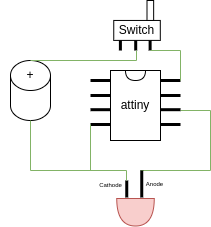
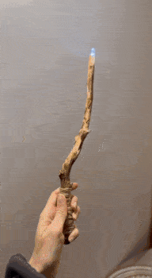

# LED Fading Effect

## Description

This project involves a firmware for the ATtiny13a microcontroller, designed to create a dynamic LED fading effect. The code controls the brightness of an LED connected to pin PB1, varying its intensity between randomly determined minimum and maximum levels. The fading speed and the delay between brightness changes are also randomly set, giving a unique and visually appealing effect each time.

## Variables

- `int ledPin = PB1`: The pin number to which the LED is connected. Set to PB1 by default.
- `int minValue`: The minimum brightness level of the LED. Randomly set between 50 to 100 in `setup()`.
- `int maxValue`: The maximum brightness level of the LED. Randomly set between 160 to 250 in each `loop()` cycle.
- Additional variables include `fadeSpeed` and `fadeDelay`, which control the speed of fading and the delay between brightness changes, respectively.

## Circuit

The circuit for this project is straightforward. It involves connecting an LED to the ATtiny13a microcontroller. A resistor is used in series with the LED to limit current and protect the LED. The following image provides a visual representation of the circuit:

## Examples

This firmware can be used in various DIY projects to create visually appealing lighting effects. Some example projects include:

1. **Magic Stick**: Implementing this firmware in a handheld stick with LEDs can create a 'magic wand' effect, ideal for parties or as a toy.

2. **Epoxy Heart**: Embedding LEDs in an epoxy resin heart with this fading effect can create a romantic or decorative item, perfect for gifts or home decor.

Feel free to experiment and come up with your unique applications!
